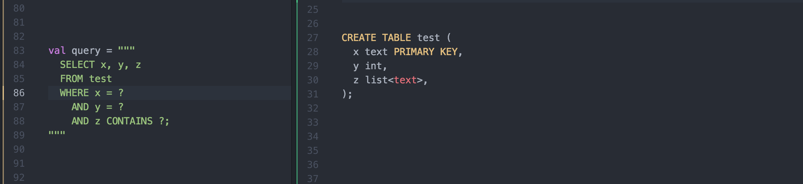
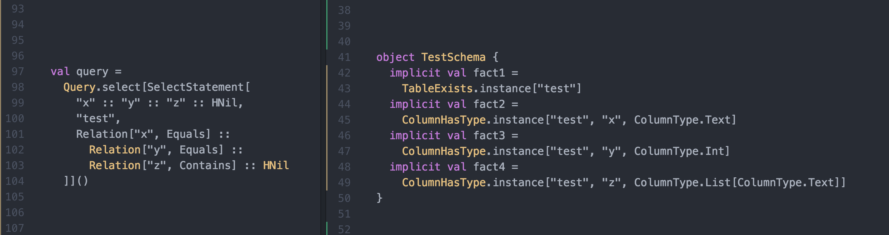

Toy-troy is simplified version of [Troy](https://github.com/cassandra-scala/troy/), the schema-safe Cassandra driver.
The main purpose of this repo to demonstrate the underlying concept of Troy by implementing only a small subset of it.

# What Troy allows you to do
You write your code using CQL strings

# What Troy does under the hood
Using Macros, the CQL strings above gets expanded into:

# How this works?
Type level programming...
TODO: Explain basic type classes
